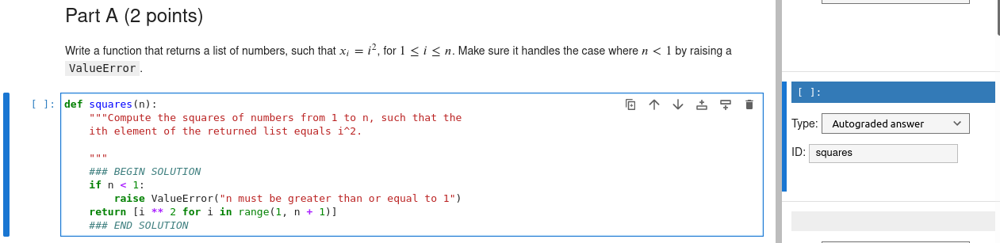
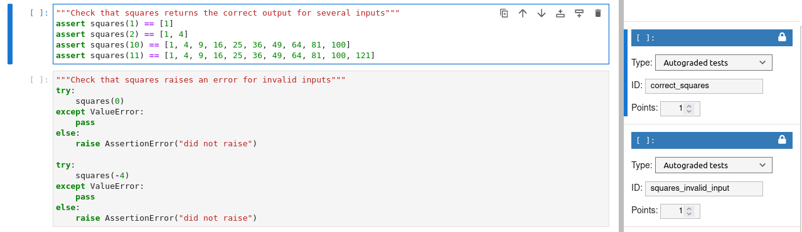

---
jupyter:
  jupytext:
    formats: ipynb,md
    text_representation:
      extension: .md
      format_name: markdown
      format_version: '1.3'
      jupytext_version: 1.16.1
  kernelspec:
    display_name: Python 3 (ipykernel)
    language: python
    name: python3
---

# Advanced Jupyter
Jupyter notebooks are often treated as glorified REPLs. This tutorial aims to show you they are so much more.

The tutorial will cover 

1. JupyterLab: The Next-Generation Notebook Interface
2. Useful magic commands
3. Customizing JupyterLab settings
4. Using the debugger
5. Installing extensions
6. Using notebooks in the classroom
7. Using LLMs in notebooks
8. Version control of notebooks
9. Exporting notebooks to other formats


# JupyterLab

JupyterLab is "The Next-Generation Notebook Interface". It still supports classic notebooks, but its capabilities far exceed the standard notebook interface. 

Here are some reasons to use JupyterLab over Jupyter Notebook:

1. **Interface and User Experience**: JupyterLab provides an enhanced UI experience thanks to its integrated file manager, terminal emulator, text editor, image viewer, etc. It offers a more intuitive layout compared with Jupyter Notebook's interface which is based on notebooks alone.

2. **Multiple Panel Layouts**: With JupyterLab, users can arrange multiple panels side by side to work with code, output, and terminal simultaneously, giving them the flexibility of splitting their workspace into multiple panes for more efficient workflows. This is not available in Notebook.

### Try opening [zen.txt](./zen.txt) and repositioning the tabs! Try dragging a tab to one side of your screen.

3. **Extensions**: JupyterLab comes bundled with numerous useful extensions that provide additional features. You can extend your computing experience by installing and enabling extensions, including support for Data Science tools like TensorBoard, or visualization libraries like Plotly, etc. Not available in Notebook.

4. **Interactive Widgets**: JupyterLab has interactive widgets that are used to embed small applications inside notebooks and dashboards making them a perfect tool for Data Science work which needs UI-based features. Notebooks do not support such out of the box, but this feature can be added using ipywidgets or similar packages.


# Useful Magic Commands
You can think of magic commands as macros. They can execute Python and other languages.

These are not specific to lab---they come from the IPython kernel itself.

```python
# List all magic commands
%lsmagic
```

```python
# Get a short description of each
%quickref
```

## %env
This lets you set environment variables.

```python
%env MY_VAR=test
```

## %autoreload
This extension will reload your imports before running code. This is **extremely** useful if you are actively developing a package.

```python editable=true slideshow={"slide_type": ""}
# Load the extension
%load_ext autoreload  
```

The extension has some options for how it reloads your code:

```python
# Reload all modules that are imported as `%aimport <module_name>`
%autoreload 1
```

```python
# Reload all modules EXCEPT for those that are imported as `%aimport <module_name>`
%autoreload 2
```

## %conda
This lets you run conda commands inside of Jupyter!

```python
%conda list
```

## %%time and %%timeit
Time the execution of a cell.

```python
%%time
# Run the cell once
[[1,2,3]]*10
```

```python
%%timeit
# Run the cell multiple times and model as a normal distribution
[[1,2,3]]*10
```

## One you probably know: shell commands
You can run arbitrary shell commands with the `!<command>` syntax

```python
!ls
```

```python
# Capture the output
files = !ls
files
```

# Customize Jupyter Settings
JupyterLab has a convenient GUI to customize settings. In the toolbar, it is under `Settings->Settings Editor`. You can also access it with `Ctrl+,`. 

Below, I've intentionally included a typo in a raw text block. Go into the settings and search for the spellchecker settings. Change the settings to show a red underline under misspelled text.

<!-- #raw -->
This is a typoe
<!-- #endraw -->

# Using the Debugger
JupyterLab has a built in debugger. You can start a debugging session by clicking the small bug icon in the top right of the interface.

Let's see an example. In the following function, put a break point on line 2 (click on the red dot that shows up when you hover near the line number). Then, run the next cell.

To exit the debugger, click the bug icon again.

```python
def my_add(a, b):
    res = a + b
    return res
```

```python
result = my_add([1, 2], [3, 4])
print(result)
```

# JupyterLab Extensions
This is JupyterLab's superpower. The easy extensibility allows for many more extensions than standard notebooks.

JupyterLab has a built-in extension manager. You can open it by clicking the "puzzle piece" icon on the left toolbar.

You should see that there are already extensions installed in this environment. I installed them with conda, but let's see how we can install directly from the manager with an example (install a theme).

After you install a new theme, you should find it in the `Settings` toolbar.


## JupyterLab LSP: A must-have extension
The Language Server Protocol (LSP) defines the protocol used between an editor or IDE and a language server that provides language features like auto complete, go to definition, find all references etc.

The JupyterLab-LSP plugin gives us IDE features from PyCharm, VSCode, etc. right in our notebooks!

```python editable=true slideshow={"slide_type": ""}
# Example: Go to a definition. Right click the function call and select the option
my_add(1, 2)

# Example: Rename symbol. You can again find this in the right click menu
my_add(1, 2)  # Rename this to 'my_sum'

# Example: Passing incorrect arguments to function. Uncomment and see what happens!
# my_sum(1, 2, 3)

# Now, try typing `my_` and hitting tab. This auto-complete is much more advanced than the built-in
```

# In the Classroom
Jupyter can be used to create and automatically grade coding assignments. The most popular package for this is `nbgrader`. Here's an example of how it works:
## First, Make a Prompt and Ideal Solution


### There is a very nice JupyterLab pluging that makes authoring these assignments very easy!

## Now, Write Tests that are Used to Grade the Code



# Large Language Models in JupyterLab
The Jupyter development team recently released an extension to interact with LLMs through JupyterLab. There is a standard "chat" interface, and there are magic commands.

The chat interface appears as a small text bubble on the left side toolbar. In it, you can set the LLM API endpoint according to whatever model you'll use. See [the docs](https://jupyter-ai.readthedocs.io/en/latest/).

```python editable=true slideshow={"slide_type": ""}
# First, we load the magic commands
%load_ext jupyter_ai_magics

# Set env vars. For my demo, these are fake/localhost because I am running a local LLM
%env OPENAI_API_KEY=sk-111111111111111111111111111111111111111111111111
%env OPENAI_API_BASE=http://127.0.0.1:11434/v1
```

```python
%%ai chatgpt -f code
write a python function that squares a number
```

```python
def square_number(num):
    return num ** 2

```

```python
%%ai chatgpt -f code
write a python function that uses numpy and matplotlib to plot a sine curve
```

```python
import numpy as np
import matplotlib.pyplot as plt

def plot_sine():
    x = np.linspace(0, 2 * np.pi, 100)
    y = np.sin(x)
    
    plt.figure()
    plt.plot(x, y)
    plt.show()

plot_sine()
```

```python
%%ai chatgpt -f text
write a haiku about data science
```

# Version Control
We can use the Git extension to version control our notebooks.

Let's look at the current status of this repository from the toolbar.

Now, lets make some commits and compare versions.

```python
# Uncomment this to make a change. Now, commit using the tool that has the Git icon on the left toolbar.
```

<!-- #region -->
## Exporting Notebooks
JupyterLab has a built-in export functionality. You can export to a variety of formats. Try using `File->Save Notebook and Export As`

### Plain text notebooks
Would you prefer your notebooks to have a plain-text version? Use `jupytext`

Open the command palette with `Ctrl+Shift+C` and search for `pair`. You'll find a number of plain text formats you can pair your notebook with. This plain text version will update every time you save the notebook.

I'll pair this notebook with a `.md` file [here](./advanced-jupyter.md).

### Quarto
Want nicely formatted slides or a web page? Use Quarto. It is a separate [install](https://quarto.org/docs/get-started/), but the results are very much worth it.
I've included the [default HTML export](./advanced-jupyter.html) of quarto created using the following command:
```sh
quarto render advanced-jupyter.ipynb --to html
```
<!-- #endregion -->
